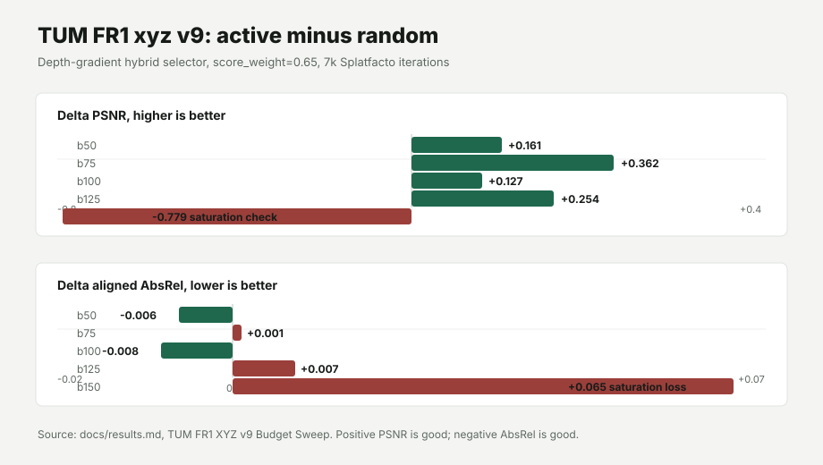

# Blog Asset Packet: Active View Selection

Use this packet as the compact source for a blog post. The full audit trail is
in `docs/results.md` and `docs/run-manifest.md`.

## One-Sentence Claim

Uncertainty is useful when it is treated as a tail-risk signal and mixed with
pose diversity: it helps choose compact training views for neural rendering,
but it is not a reliable ordering of the entire trajectory.

## Main Figure

Source table: `tum-fr1-xyz-v9-budget-sweep.csv`.

## Blog Table

| Budget | Random PSNR | Active PSNR | Delta PSNR | Random LPIPS | Active LPIPS | Delta LPIPS | Random aligned AbsRel | Active aligned AbsRel | Delta aligned AbsRel | Outcome |
|---:|---:|---:|---:|---:|---:|---:|---:|---:|---:|---|
| 50 | 18.935 | 19.096 | +0.161 | 0.279 | 0.265 | -0.014 | 0.177 | 0.171 | -0.006 | RGB positive and modest depth positive |
| 75 | 18.943 | 19.305 | +0.362 | 0.267 | 0.261 | -0.006 | 0.169 | 0.170 | +0.001 | RGB positive and aligned depth mixed |
| 100 | 19.220 | 19.347 | +0.127 | 0.260 | 0.256 | -0.004 | 0.171 | 0.163 | -0.008 | Cleanest RGB and depth win |
| 125 | 19.333 | 19.587 | +0.254 | 0.257 | 0.245 | -0.012 | 0.167 | 0.174 | +0.007 | RGB positive but aligned depth down |
| 150 | 19.609 | 18.829 | -0.779 | 0.250 | 0.278 | +0.028 | 0.156 | 0.221 | +0.065 | Saturation negative control |

## Supporting Scene Summary

| Scene group | Seeds | Active-vs-random delta |
|---|---:|---|
| BWW entrance | 4 | +2.016 PSNR, +0.031 SSIM, -0.021 LPIPS |
| Dozer | 4 | +0.779 PSNR, +0.020 SSIM, -0.018 LPIPS |
| Redwoods2 | 4 | +0.699 PSNR, +0.027 SSIM, -0.012 LPIPS |
| Library | 3 | +0.496 PSNR, +0.015 SSIM, -0.003 LPIPS |
| Kitchen | 4 | Mixed hard-scene result: +0.687 PSNR, +0.002 SSIM, -0.028 LPIPS |
| TUM FR1 xyz v1-v6 | 6 | Depth-gradient fixed policy: +0.264 PSNR, +0.007 SSIM, -0.003 LPIPS, -0.005 aligned AbsRel |

## Post Outline

1. Start with the practical problem: training every frame is wasteful, but
   choosing fewer frames can miss geometry or photometric failures.
2. Explain the active-selection idea: train a small seed model, score candidate
   frames by uncertainty or error-risk maps, then add views while preserving
   camera-pose diversity.
3. Show the sample-scene replication: BWW, dozer, redwoods2, and library
   support the RGB story; kitchen is the stress case.
4. Move to RGB-D: depth-bearing TUM runs make the problem harder because a
   view can look good photometrically while depth geometry is still wrong.
5. Use the v9 budget sweep as the clearest result: active helps b50-b125 on
   RGB, b100 is the clean RGB/depth win, and b150 proves the selector should be
   treated as compact subset selection rather than a full trajectory ordering.
6. Close with the next validation: repeat the compact b50/b100 experiment on a
   second TUM RGB-D scene.

## Caveats To Keep In The Post

- The best signal changes by scene. Transmittance helped some desk and room
  runs; depth-gradient is the safer fixed policy for the current xyz evidence.
- Kitchen and b150 are important negative controls. They prevent the result
  from sounding like "uncertainty always wins."
- The project currently evaluates offline acquisition. It is not yet a
  real-time robot planner.
- Checkpoints and rendered outputs are not in Git. The manifest records Modal
  volume paths and commands so the result can be audited.
